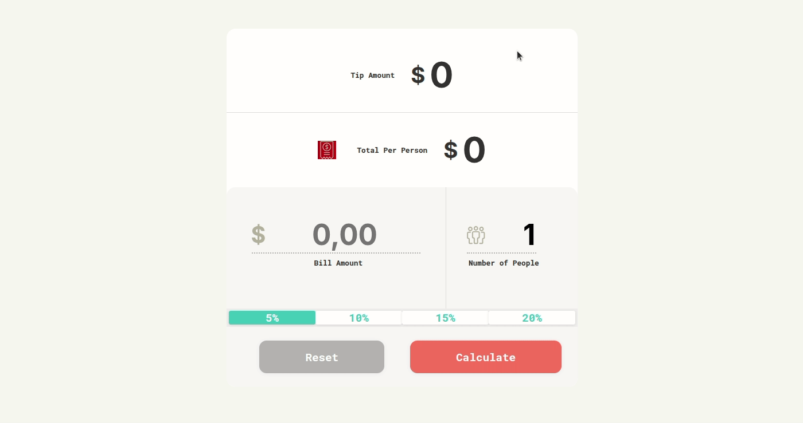

# Bill and Tip Calculator (JavaScript) 
Live Site URL: https://antonina-kachusova.github.io/Bill-and-Tip-Calculator-JavaScript/

A stylish and responsive tip calculator built with **HTML**, **CSS**, and **Vanilla JavaScript**.  
Supports large numbers (e.g. millions) with proper formatting using thousands separators and decimal commas (`1 250 500,25`), and includes live input masking for optimal user experience.

## Features

- Calculates tip and total per person instantly
-  Supports formatting of big values (like `1 000 000,00`)
-  Uses [IMask.js](https://imask.js.org/) for input masks
-  Responsive and clean UI
-  Reset button to clear inputs and reset to defaults
-  SVG icons for intuitive UX
-  Decimal comma formatting (`UA/European style`)

## Technologies Used

- HTML5
- CSS3 with Flexbox
- JavaScript (ES6+)
- [IMask.js](https://unpkg.com/imask) — for input masking

## UI Preview

| Feature           | Example                  |
|------------------|--------------------------|
| Tip Amount       | `$5 000,00`              |
| Total Per Person | `$1 250 500,25`          |
| Input Masking    | `1 000,00` (with comma)  |
| Reset Function   | Clears all fields        |

## Demo
Try it live by opening `index.html` in your browser.

## Usage

1. Clone or download the repo.
2. Open `index.html` in any modern browser.
3. Enter the bill amount and number of people.
4. Select a tip percentage.
5. Click **"Calculate"** or press `Enter`.
6. Click **"Reset"** to clear everything.

## Project Structure
- `index.html` – Main HTML structure  
- `styles.css` – All styling including responsiveness  
- `app.js` – JavaScript logic with input masks and calculations  
- `images/` – Folder with SVG icons:
  - `bill.svg`
  - `dollar.svg`
  - `people.svg`
- `demo.gif` – Demo animation  
